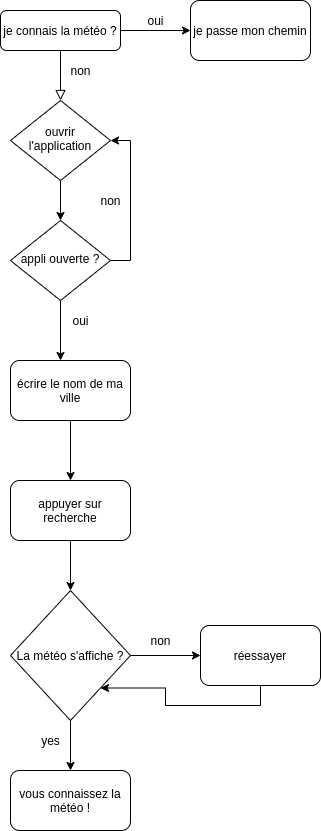
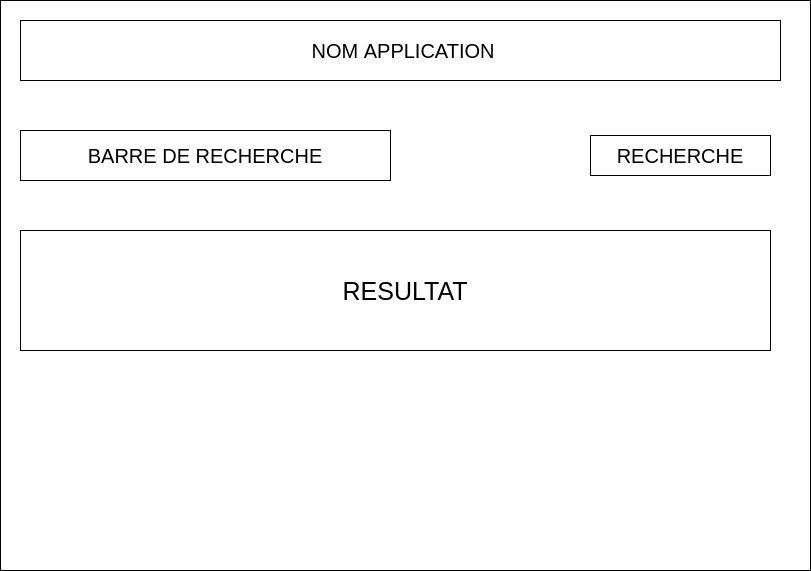

# Salut ceci est ma première application !

    Son utilisation est simple écrivez votre ville dans l'espace indiquez et l'application vous montrera le temps sur place !

    Pensez à mettre des tirets "-" à la place des espace pour les noms de ville composées

## Algo de la fonction météo :

## Prototype de l'application :

